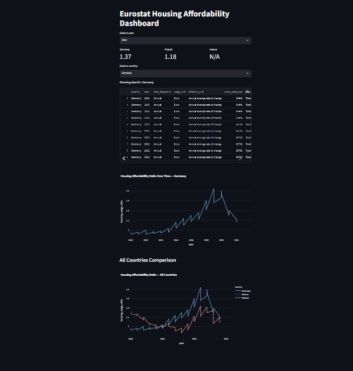

# Eurostat Housing Affordability Tracker

A data engineering portfolio project tracking housing affordability trends across Germany, Poland, and Greece, using Eurostat public data.

## Architecture

Eurostat API → Python ingestion scripts (Extract + Load) → raw tables (Postgres) → dbt staging (clean/rename) → dbt marts (join + business logic) → Streamlit dashboard

## Tech Stack

- **Ingestion**: Python, SQLAlchemy, polars, pyjstat
- **Storage**: PostgreSQL (Docker)
- **Transformation**: dbt
- **Dashboard**: Streamlit, Plotly
- **Testing**: pytest, dbt tests
- **CI/CD**: GitHub Actions

## Data Quality Notes

During development, several data quality issues were identified in the raw Eurostat data and resolved at the appropriate pipeline layer:

### 1. Duplicate currency units in wages data

The raw wages dataset (`raw_wages`) contained each country/year combination **twice** — once in Euro, once in the national currency (e.g., Polish Zloty). Without filtering, this caused row duplication in downstream joins.

**Resolution**: Filtered to `Euro` only, in the staging layer (`stg_wages.sql`), so all wage figures are consistently comparable across countries.

### 2. Duplicate category/unit combinations in housing data

The raw housing dataset (`raw_housing`) contained 3 purchase categories × 4 measurement units per country/quarter (12 possible rows per combination), when only one clean series was needed.

**Resolution**: Filtered to `Purchases = 'Total'` and `Unit of measure = 'Quarterly index, 2015=100'`, in the staging layer.

### 3. Inconsistent filtering approach across sources

Note: inflation data is filtered at the **API URL level** (query parameters), while wages and housing are filtered in **dbt staging** (SQL WHERE clauses). This inconsistency is a known trade-off from incremental development and is documented here rather than retroactively "fixed", to preserve an honest record of the pipeline's evolution.

### 4. Partial rows from FULL JOIN in marts_core

`marts_core` uses a `FULL JOIN` across staging models, which means some rows have `NULL` values where one source hasn't published data yet for a given country/year — for example, Germany 2025 has inflation data but not yet wages data at time of writing.

This is intentional: the FULL JOIN preserves all available data rather than silently dropping partial rows, at the cost of requiring NULL-handling in downstream models (e.g. `marts_ranking` filters out NULL ratios before ranking).

### 5. Greece has no housing data

Greece is entirely absent from the housing dataset at the source (Eurostat). This means Greece never appears in `marts_ranking` (which requires a housing_wage_ratio), but does appear normally in wage/inflation-only views.

## Planned Future Improvements

The following were consciously deferred, not overlooked — each is noted here with the reasoning:

1. **Incremental loading + UPSERT logic**: Ingestion currently uses `if_table_exists='fail'` (no re-runs/updates). A production version would use dbt incremental materialization with a `unique_key` (country+year) and corresponding UPSERT logic in the Python layer, to handle late-arriving or revised source data.

2. **Real wage index (inflation-adjusted)**: `inflation_rate` is captured but not yet used in calculations. A real wage index would require a cumulative/chained calculation across years (more complex than the simple 2015-rebase used for `wage_2015_index`), and was deferred to keep initial scope focused.

3. **`materialized='table'` for marts models**: Currently views (re-computed on every query). If dashboard usage grows, switching to table materialization would trade query speed for the need to re-run `dbt run` on a schedule.

4. **Streamlit — synchronized filters**: KPI cards and charts currently use independent selectors (year, country). A more polished version would synchronize all visuals to a single set of filters.

5. **CI/CD — dbt seeds instead of live API calls**: The CI pipeline currently re-fetches from the live Eurostat API on every push. This works but is a known anti-pattern (external dependency, slower, rate-limit risk). A cleaner approach would use `dbt seed` with a small sample CSV committed to the repo.

6. **CI/CD — lint step**: A code style/quality check (e.g. `ruff`) was scoped for CI but not yet implemented.

7. **GitHub Secrets**: Not currently needed — CI uses a disposable, single-use database  that is destroyed after each run. If real credentials or API keys were ever involved, GitHub Secrets would replace any hardcoded values in the workflow.